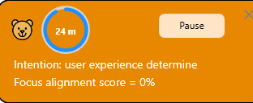
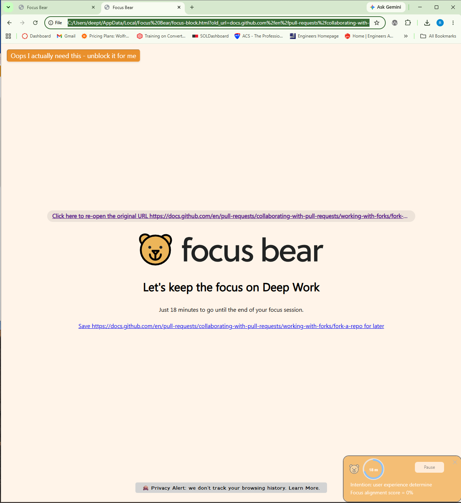
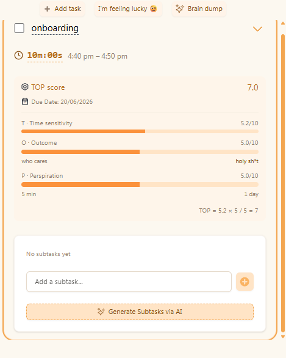

# First-Time User Experience Feedback

## Issue 1: Steep Learning Curve and Feature Discoverability

### What I was trying to do

I wanted to block a gaming application while I was already in an active focus session.

### What happened

I spent several minutes navigating through both the desktop and mobile applications trying to locate the app-blocking settings. I could not easily determine whether application blocking could be configured during an active session and eventually assumed that it was not possible.

### Why this was confusing

As a new user, I expected app blocking to be one of the primary features of the application. However, I found myself navigating through multiple menus and settings before understanding how blocking worked during an active session.

### Suggested Improvement

Introduce a guided onboarding flow, a demo session that highlights core features such as focus sessions, website blocking, application blocking, and focus modes.

---

## Issue 2: Focus Alignment Score Is Not Self-Explanatory

### What I was trying to do

I started a focus session and entered an intention for the session.

### What happened

The application displayed a Focus Alignment Score of 0%, but I did not understand what the score represented or how it was calculated.

### Why this was confusing

There was no explanation of what affects the score, how it changes, or how users can improve it.

### Screenshot

### Suggested Improvement

Add a tooltip or help button explaining how the score works and how users can improve it.

---

## Issue 3: Unclear Website Unblock Behaviour

### What I was trying to do

During a focus session, I attempted to access a website that had been blocked.

### What happened

The blocked page displayed an option labelled "Oops I actually need this – unblock it for me". I expected this to immediately restore access, but the website remained inaccessible until I switched from Grizzly Bear mode to Cuddly Bear mode.

### Why this was confusing

The button label suggested immediate access would be restored, but the actual behaviour was unclear.

### Screenshot

### Suggested Improvement

Provide clear feedback explaining exactly what happens when users click the unblock option.

---

## Issue 4: Lack of Focus Insights for Users Who Want Self-Awareness

### What I was trying to do

I wanted to understand how I spent my time during a focus session without relying entirely on website or application blocking.

### What happened

The application provided limited information about how my time was actually spent during the session.

### Why this was confusing

I could not easily determine whether I remained focused, switched tasks, or spent time away from my work.

### Suggested Improvement

Introduce an optional Focus Insights Mode that provides session summaries, application usage statistics, inactivity detection, and productivity reports while remaining privacy-conscious.

---

## Issue 5: TOP Score and Task Prioritization System Are Difficult to Understand

### What I was trying to do

I wanted to prioritize tasks using the To Do Player.

### What happened

The application displayed a TOP score based on Time Sensitivity, Outcome, and Perspiration, but I did not understand how the score was calculated or how I should choose values.

### Why this was confusing

There was no explanation of what TOP stands for, what constitutes a good score, or how the score should influence task prioritization.

### Screenshot

### Suggested Improvement

Provide tooltips, examples, and explanations showing how the scoring system works and how users should evaluate tasks.

---

## Issue 6: Lack of Easily Accessible FAQ or Contextual Help

### What I was trying to do

I wanted to understand features such as Focus Alignment Score, TOP Score, focus modes, and blocking behaviour.

### What happened

Although tutorial videos exist in Help \& Support, I did not naturally discover them during normal usage and often had to rely on trial and error.

### Why this was confusing

Many concepts in Focus Bear are unique and not immediately obvious to first-time users.

### Suggested Improvement

Add contextual help icons, feature-specific explanations, and links to relevant help resources directly within the interface.

---

# Onboarding Improvement Ideas

## Idea 1: Interactive First-Time User Walkthrough

Provide a guided onboarding experience that introduces focus sessions, blocking settings, focus modes, and other key features step-by-step.

## Idea 2: Contextual Help and Discoverability Improvements

Provide help icons, FAQs, and feature explanations directly beside complex features so users can learn without leaving their current workflow.

